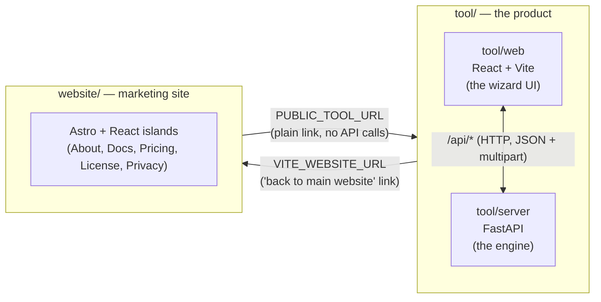
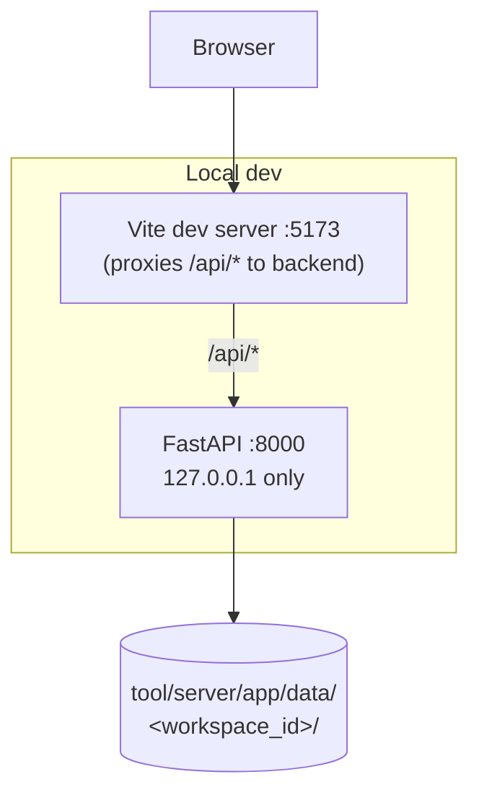
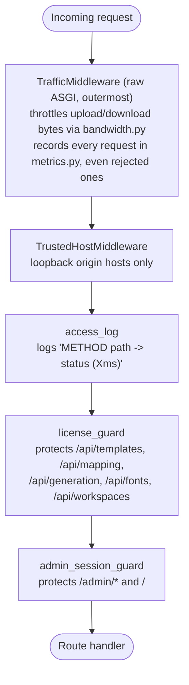
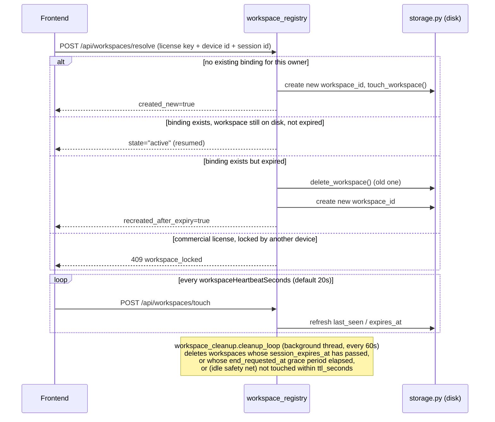
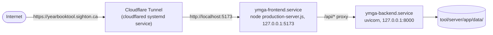

# Architecture

## Two independent halves

The repository is one Git history but **two applications that deploy, build, and run completely independently**:



- **`tool/`** is the actual product: a FastAPI backend (`tool/server/`) and a React/Vite frontend (`tool/web/`). This is what generates yearbook spreads.
- **`website/`** is a static Astro marketing/info site with React islands for the interactive bits. It has **no backend and no licensing logic of its own** — every "Tool" link and "Open the Tool" CTA is a plain `<a href>` to wherever `tool/web` is deployed.

They share no build step, no runtime, and no database. The only coupling is two absolute URLs, each read from a build-time env var:

### Cross-project wiring

| From | Env var | Read by | Used for |
|---|---|---|---|
| `website/.env` | `PUBLIC_TOOL_URL` | `website/src/lib/env.ts` → `TOOL_URL` | Every "Tool" nav link and "Open the Tool"/"Get Started Free" CTA (`SiteTopBar.tsx`, `AboutPage.tsx`, `PricingPage.tsx`). Plain link, no query params. |
| `tool/web/.env` | `VITE_WEBSITE_URL` | `tool/web/src/env.ts` → `WEBSITE_URL` | The "Back to main website" link and the license-gate screen's fallback link (`ToolAppPage.tsx`). Not used for any API call. |

Both are Vite/Astro `PUBLIC_*`/`VITE_*` variables, meaning **they're inlined into the static JS bundle at build time**, not read at request time. Changing one in a deployed environment (e.g. a Cloudflare dashboard env var) does nothing until the site is rebuilt and redeployed — see [`06-website.md`](06-website.md#build-time-vs-runtime-env-vars) for the sharp edge this creates. Local defaults: tool backend on `:8000`, tool frontend on `:5173`, website on `:4321` (documented in each `.env.example`).

License entry, validation, and free-key requests all happen **inside `tool/web`** (`ToolAppPage.tsx`, via `tool/web/src/licensing.ts` calling the same-origin/proxied `/api/licensing/*`) — the website never touches licensing.

## Inside `tool`: backend and frontend



- The **frontend** (`tool/web/src/App.tsx`) is a step-by-step UI that collects files, drives review/editing, and shows progress. It calls the backend exclusively through `tool/web/src/api.ts`, a single typed Axios-based client — see [`05-frontend.md`](05-frontend.md).
- The **backend** (`tool/server/app/main.py` + `routes/` + `services/`) does the actual work: computer-vision template parsing, spreadsheet/photo matching, image compositing, licensing, and workspace lifecycle management — see [`03-backend.md`](03-backend.md).
- In local dev, the browser only ever talks to Vite (`:5173`); Vite's dev-server proxy (`tool/web/vite.config.ts`, `server.proxy` / `preview.proxy`) forwards `/api/*` to the FastAPI backend at `127.0.0.1:8000`. There is no separate "API base URL" configured anywhere in the frontend — every call in `api.ts` uses a root-relative path (`/api/...`) and relies on same-origin serving, in both dev (via the Vite proxy) and production (see [Production topology](#production-topology) below).
- All API payloads are **snake_case JSON** end-to-end (Pydantic ↔ hand-written TypeScript types) — there's no shared schema/codegen step, so `tool/server/app/models/schemas.py` and `tool/web/src/api.ts`/`types.ts` must be kept in sync by hand.

## Backend request flow (middleware stack)

Every HTTP request to the FastAPI app passes through several layers before reaching a route handler, registered in `tool/server/app/main.py`. From outermost to innermost:



1. **`TrafficMiddleware`** (`tool/server/app/main.py`) — a raw ASGI middleware (not the decorator-based kind), registered last via `app.add_middleware(...)`, which places it **outermost**. It wraps `receive`/`send` to throttle inbound/outbound byte chunks through `services/bandwidth.py`'s token buckets, and unconditionally calls `services/metrics.py`'s `record_request(status, duration_ms)` in a `finally` block — so request-volume/latency metrics capture *every* request, including ones later rejected by the guards below it.
2. **Host and same-origin policy** — the backend accepts configured loopback origin hosts. No permissive CORS layer is enabled because browsers use the frontend's same-origin `/api` proxy.
3. **`access_log`** — logs every request/response to the `ymga.access` logger (`METHOD path -> status (Xms)`); logs and re-raises on exceptions. Uvicorn's own access logger is disabled to avoid duplicate lines.
4. **`license_guard`** — for any path under `/api/templates`, `/api/mapping`, `/api/generation`, `/api/fonts`, or `/api/workspaces`, requires a valid license key. It accepts the normal `X-License-Key`/`X-Device-Id` headers or the HTTP-only, same-site session cookies created by successful license validation. Credentials are not accepted in query strings. On success, it stashes `request.state.license_key` / `license_device_id` / `license_meta` / `client_session_id` for the route to use. On failure, it returns `401` JSON with a `reason` code and a human-readable `hint`. `/api/licensing/*`, `/admin*`, `/health`, `/docs`, `/openapi.json`, `/redoc` remain outside this guard.
5. **`admin_session_guard`** — for `/admin/*` and `/` (the dashboard root), verifies an HMAC-signed session cookie (`ymga_admin_session`); falls back to HTTP Basic auth (`YMGA_LICENSE_ADMIN_USERNAME`/`YMGA_LICENSE_ADMIN_PASSWORD`) and mints a fresh session cookie on success, otherwise returns a 401 HTML page.
6. The route handler runs, delegating to `services/*.py`.

See [`03-backend.md`](03-backend.md#middleware--request-guards) for the exact reason codes, cookie format, and session timeout settings.

### Startup / shutdown (`lifespan`)

On startup, `main.py`'s `lifespan`:

- Calls `throttle.apply_cpu_limits()` (applies the admin-configured CPU thread cap + OS process priority).
- **Wipes all workspaces** under `tool/server/app/data/` unless `YMGA_CLEAR_WORKSPACES_ON_STARTUP` is explicitly set to a falsy value (`0`/`false`/`no`/`off`) — default is to wipe. Underscore-prefixed internal directories (`_licenses/`, `_settings/`) are preserved. This is best-effort and never blocks startup.
- Starts two daemon background threads: `workspace_cleanup.cleanup_loop` (the expiry janitor) and `system_stats.resource_history_loop` (samples CPU/RAM/GPU every 15s for the admin Usage page).

On shutdown, both threads are signalled to stop and joined with a 1s timeout.

**Practical implication:** restarting the backend in a normal local-dev or default-configured deployment destroys all in-progress work. This is intentional for privacy (see [`../PRIVACY.md`](../PRIVACY.md)), but means production deployments that need durability must explicitly set `YMGA_CLEAR_WORKSPACES_ON_STARTUP=false` — the live deployment on this project does **not** currently do that; see [`08-deployment.md`](08-deployment.md).

## Workspaces & sessions

Nearly every piece of backend state is scoped to a **workspace**: a directory `tool/server/app/data/<workspace_id>/` holding that workspace's uploaded template, extracted photos, fonts, masks, and rendered outputs. This is the central concept to understand before touching either half of `tool/`.

There are two distinct layers here, easy to conflate:

1. **The workspace itself** (`services/storage.py`) — just a directory on disk plus a `meta.json` file. Creating/reading/deleting one has no concept of licensing.
2. **The workspace *session*** (`services/workspace_registry.py`) — a persistent binding from a **license + device** (the "owner") to a workspace, with its own expiry policy and, for commercial licenses, a single-checkout **lock**. This is what the frontend calls `POST /api/workspaces/resolve` to obtain.

### Lifecycle



**Owner key** (`_owner_key`, `workspace_registry.py`) determines isolation granularity:
- **Personal licenses**: always `pers:{key}:{device}` — one workspace per device, even for the same key.
- **Commercial licenses**: `comm:{key}` (workspace shared across every device using that key — the default, `commercial_workspace_key_mode="license_only"`) or `comm:{key}:{device}` (isolated per device, `"license_and_device"`) — an admin-configurable setting.

**Checkout locking** exists only for commercial licenses (personal workspaces are already isolated per-device, so there's nothing to contend over). A lock records `{device_id, session_id, acquired_at, last_heartbeat_at, expires_at}`; either the device id *or* the session id matching is enough to be considered the owner (supporting multiple tabs on the same device). If another device holds an active lock, `/resolve` returns `409` with `lock_expires_at`/`lock_holder_device_id`, and the frontend surfaces a "workspace in use elsewhere" screen (`ToolAppPage.tsx`'s `lockConflict` state).

### Expiry policy

This differs by license type, resolved once per `/resolve` call and cached on the registry binding (`_resolve_ttl_policy`, `workspace_registry.py`):

- **Personal** — always uses the single admin-configured setting `personal_workspace_timeout_seconds` (`/admin/settings`, default 8h). No per-license override is possible for personal keys.
- **Commercial** — configured per-license on `/admin/licenses`: either a custom `workspace_expiry_seconds` duration, or `workspace_expiry_disabled` to never expire. Falls back to an 8-hour default if neither is set on the license.

`touch_workspace()` (`services/storage.py`) enforces that **expiry can only move earlier, never later** across repeated heartbeats (`min(previous_expiry, candidate_expiry)`), and clears any pending `end_requested_at` on every heartbeat (a heartbeat cancels a pending graceful end-session).

### Cleanup janitor

`services/workspace_cleanup.py`'s `cleanup_loop` runs every 60s (configurable) and, for each workspace on disk:

1. Skips it entirely if there's an active generation job running against it (`progress.list_jobs()`).
2. Deletes it if `session_expires_at` has passed (and `auto_delete_expired_workspaces` is on).
3. Otherwise deletes it if an explicit end-session was requested and its grace period (default 20s) has elapsed — **this always applies**, even to `workspace_expiry_disabled` workspaces, since an explicit "delete this now" request is honored regardless of expiry policy.
4. Otherwise, as an idle safety net, deletes it if it hasn't been touched in `ttl_seconds` — but **only if `workspace_expiry_disabled` is not set** on that workspace. This is the specific mechanism by which "never expire" commercial workspaces are protected from the idle sweep: they can only be removed by an explicit end-session request.

### Storage layout

```
tool/server/app/data/
├── _licenses/              # internal — license store, workspace registry, audit log, usage log
│   ├── licenses.json
│   ├── workspace_registry.json
│   ├── workspace_audit.json
│   ├── usage.json
│   └── secret.txt          # auto-generated license-key HMAC secret (or set YMGA_LICENSE_SECRET)
├── _settings/               # internal — admin-configurable settings overlay
│   └── settings.json
└── <workspace_id>/          # one per active workspace (wiped on startup by default)
    ├── meta.json                       # session/TTL/lock metadata
    ├── template_clean.png              # clean template (root copy, used by the renderer)
    ├── uploads/                        # raw uploads, kept for re-processing
    │   ├── template_clean.png
    │   ├── template_annotated.png
    │   ├── spreadsheet.<ext>
    │   ├── mugshots.zip
    │   ├── baby.zip
    │   └── quotes.<ext>
    ├── mugshots/                       # extracted/individual portrait images
    ├── baby/                           # extracted/individual baby photos
    ├── fonts/                          # uploaded TTF/OTF fonts
    ├── masks/baby/{x}_{y}_{w}_{h}.png  # per-slot baby cutout masks (keyed by slot coords)
    ├── generation/requests/{stem}.json # persisted GenerationRequest payloads, one per output
    ├── output.png / output_N.png       # rendered spreads (or .pdf / .tiff)
    └── preview.png                     # single-page preview render
```

Internal (`_`-prefixed) directories are excluded from the startup wipe and from `services/storage.py`'s `list_workspace_ids()`. `services/storage.py` validates every `workspace_id` against `^[0-9A-Za-z_-]{3,64}$` before any path join or deletion, as a path-traversal guard.

## Production topology

The live deployment (see [`08-deployment.md`](08-deployment.md) for full details) differs from local dev only in how the two tool processes are supervised and exposed — the request path (`browser → frontend → backend`) is identical:



- Both tool services are loopback-only. Remote browsers must use the Cloudflare-protected HTTPS hostname; the Vite proxy forwards same-origin `/api/*` requests to FastAPI.
- Neither systemd service auto-updates on code changes — the backend needs a restart to pick up Python changes, the frontend needs a rebuild (`npm run build`) *and* a restart to pick up frontend changes.
- The marketing website is a separate, unrelated deployment target (Cloudflare Workers, auto-deployed from Git) — see [`06-website.md`](06-website.md).
