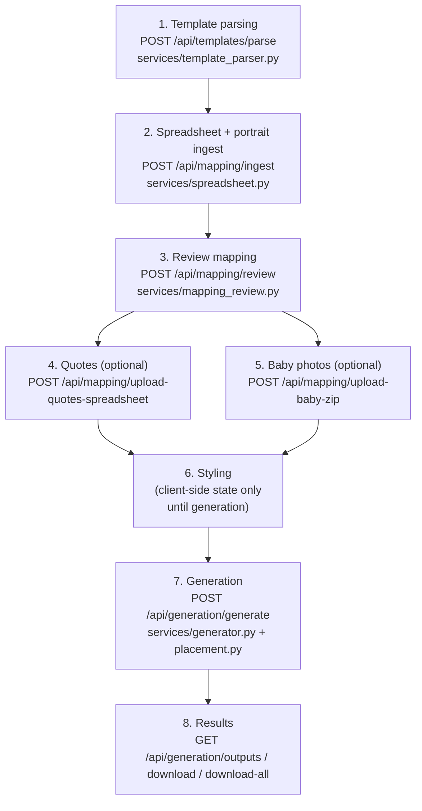

# The generation pipeline

This is a deep walkthrough of what actually happens, algorithmically, from "user uploads a template" to "finished spread PNG on disk." It's organized by pipeline stage; each stage names the backend endpoint, the service module that implements it, and the frontend step that drives it.

In the frontend, stages 1 is the **Template** step, stages 2/4/5 are the **Roster & Photos** / **People** steps (all three optional-upload cards live on `ImportStep`, mapping review lives on `PeopleTab`), stage 6 is the **Style** step, and stages 7–8 are the **Generate** step. See [`05-frontend.md`](05-frontend.md#the-5-step-roadmap) for how the UI maps onto these.

## 1. Template parsing

**Endpoint:** `POST /api/templates/parse` · **Service:** `tool/server/app/services/template_parser.py` · **Entry point:** `extract_slots(...)`

You upload two images:

- **Annotated template** — the spread's background art with **coloured guide rectangles** drawn on top: green for portraits, blue for baby photos, orange for names, red for quotes.
- **Clean template** — the same background art *without* the guide rectangles; this is what the final render is composited onto.

The backend detects the coloured rectangles by HSV colour thresholding, groups them into one "slot" per student, and returns pixel coordinates the frontend can display and let the user fine-tune.

### Default colours

| Field | Hex | Detected as |
|---|---|---|
| Portrait/mugshot | `#00bf63` (green) | `mugshot` box |
| Baby photo | `#004aad` (blue) | `baby_photo` box |
| Name | `#ff751f` (orange) | `name` box |
| Quote | `#ff3131` (red) | `quote` box |

All four are overridable per-parse via hex query/form params (`mugshot_color`, `baby_color`, `name_color`, `quote_color`).

### Algorithm, step by step

1. **Colour conversion.** `_hex_to_hsv_range(hex, tol)` converts the target hex colour to HSV and builds a `(lower, upper)` bound with **asymmetric tolerance**: hue is toleranced by `±tol`, but saturation and value are toleranced by `±tol*2` — hue drift matters more for a false match than brightness/saturation drift.
2. **Tolerance sweep.** Real-world scans and exports rarely hit the exact hex value, so `_detect_boxes_with_color` tries a list of increasing tolerances in order and stops at the first one that finds anything: `[20, 24, 32, 40, 48]` for the default green/blue/orange/red, or `[24, 32, 40, 48, 64]` for custom colours (wider, since a user-picked colour is less likely to be a clean primary).
3. **Box extraction.** For each surviving colour mask: `cv2.findContours` (external contours only), filtered to `area >= max(min_area, 400)` (the 400px² floor is hardcoded regardless of the requested `min_area`), then `cv2.boundingRect` per contour.
4. **Fallback to hardcoded defaults.** If custom colours were supplied but found nothing, the parser retries once with the hardcoded default green/blue ranges before giving up.
5. **Hard failures.** No mugshot boxes (with baby detection also empty or disabled) → `ValueError`. No name boxes, or no quote boxes (when quotes aren't disabled) → `ValueError`. **A template must have at least one name box and one quote box to parse at all.**
6. **Cross-colour disambiguation.** Because name-orange and quote-red can visually collide with sloppy annotation, the parser removes any quote box that coordinate-matches a name box (within 15px tolerance). If that wipes out *all* quote boxes and there are more name-coloured boxes than students, it falls back to a **height-split heuristic**: sort the surviving name-coloured boxes by height, find the largest gap between distinct heights, and split there — shorter boxes become names, taller ones become quotes (or vice versa, whichever grouping matches the expected count).
7. **Reading-order sort.** `_reading_order` clusters boxes into rows by y-center (tolerance = 60% of the median box height, which absorbs minor row misalignment across columns), then sorts each row left-to-right by x-center. This produces top-to-bottom, left-to-right ordering robust to hand-drawn rectangles that aren't pixel-perfectly aligned.
8. **Slot grouping.** For each portrait box (the "primary" box — or baby box if portraits are disabled), the nearest unused baby/name/quote box (by Euclidean distance between centers) is greedily claimed to form one `TemplateSlots{mugshot, baby_photo, name, quote}`. This is greedy nearest-neighbor, not a global optimum — dense, irregular layouts can occasionally mis-pair; the frontend's `TemplatePreview` slot editor exists specifically so a human can fix that by hand. If no candidate box exists at all (e.g. a slot's quote box wasn't drawn), a synthetic box is fabricated directly below the name/mugshot box as a placeholder.
9. **Scaling.** If the clean template's pixel dimensions differ from the annotated template's, every box is scaled by the ratio between them, so coordinates always end up correct for the image that's actually rendered on.
10. **Baby mask persistence.** For every baby slot, a filled version of its detected mask (closed with a 5×5 morphological close to fill gaps) is cropped and saved to `masks/baby/{x}_{y}_{w}_{h}.png`, keyed by the baby box's *clean-template-space* coordinates. This lets the renderer later cut out non-rectangular shapes (circles, ellipses, rounded corners — whatever shape the annotator actually drew) instead of a plain rectangle. Stale masks are cleared before writing new ones.

The response (`TemplateParseResponse`) carries `template_id` (== `workspace_id`), the template's pixel `width`/`height`, the list of `TemplateSlots`, and a `raw_debug` block with the raw (pre-grouping) box lists — used for troubleshooting a bad parse.

> **In other words:** you "draw" the layout once with coloured rectangles, and every re-generation reuses those coordinates. If you need to tweak a box afterward, you don't have to re-annotate and re-upload — the Template step's Layout tab (`components/TemplatePreview.tsx` + `components/SlotInspectorFields.tsx`) lets you drag/resize/type-in-numbers directly.

## 2. Spreadsheet + portrait ingest

**Endpoint:** `POST /api/mapping/ingest` · **Service:** `tool/server/app/services/spreadsheet.py` · **Entry point:** `ingest_spreadsheet(...)`

You upload a roster spreadsheet and a ZIP of portrait images.

### Header requirement

`_find_name_columns` requires columns whose **lower-cased names contain the literal substrings** `"first name"` and `"last name"` (a header like `First Name` matches; a header like `first_name` — underscore, no space — does **not**, and ingest fails outright). This is a common gotcha — see [`09-conventions-and-known-issues.md`](09-conventions-and-known-issues.md). There's no fuzzy/normalized header matching at all; the spreadsheet's headers must literally contain the phrase "first name" and "last name" somewhere.

Every row becomes one `PersonRecord{index, first_name, last_name, mugshot_filename?, quote?, baby_photo_filename?}`, where `index` is the row's 1-based position in the sheet (not anything derived from a filename).

### Portrait matching — two passes

1. **Pass 1, name-based** (only runs if `advanced_name_match` is enabled). Each ZIP member's filename is normalized and tokenized, then checked against every person's name tokens (`first_candidates` = up to 2 distinct tokens from the first-name field, to tolerate middle names; `last_parts` = all tokens ≥2 chars from the last-name field). A file is assigned **only on a unique single match** — zero or multiple candidate matches are skipped with a warning rather than guessed. This handles files like `"Smith, John.jpg"`.
2. **Pass 2, numeric** (the default mode, and what runs for anything Pass 1 didn't claim). Each remaining filename's numeric stem must match `naming_pattern` (a regex, default `\d{3,4}`, anchored on both ends), and `mugshot_index = int(stem.lstrip("0") or "0")` is treated as a **1-based row number**. Crucially, this isn't a rigid `index == row` assignment: the matcher maintains a sorted list of row indices *not already claimed by Pass 1* and uses a binary search to find the first free index `>= mugshot_index` — so if row 3 was already claimed by a name match, a numeric file named `003.jpg` shifts down and lands on the next free row instead of colliding. Runs out of room (no free index ≥ target) → skipped with a warning.

Baby-photo and quote matching (in `routes/mapping.py`, not this module) reuse the same token-matching approach but add a **fuzzy fallback**: if no exact name-token match is found and `partial_name_match` is enabled, `difflib.SequenceMatcher.ratio()` compares compacted names and accepts the best match if its score is ≥0.86 *and* beats the second-best candidate by a margin of ≥0.03 (avoiding ambiguous near-ties). Filenames are also stripped of junk tokens first (`img`, `photo`, `scan`, `upload`, all-digit timestamp-looking tokens, etc.) before comparison.

## 3. Review mapping

**Endpoint:** `POST /api/mapping/review` · **Service:** `tool/server/app/services/mapping_review.py` · **Entry point:** `apply_mapping_decisions(people, decisions)`

Automatic matching is never perfect (a missing photo, an off-by-one in a numbered ZIP, a family that submitted the wrong file) — this endpoint lets the frontend submit a batch of corrections. Each `MappingDecision{person_index, action, replacement_mugshot?}` has one of six actions:

| Action | Effect |
|---|---|
| `keep` | No-op. |
| `replace` | Sets this person's `mugshot_filename` to `replacement_mugshot`. |
| `remove` | Clears this person's `mugshot_filename` (blank). |
| `shift` / `skip` | Cascades **downward**: every person after this position inherits the mugshot that was previously one row above them, freeing up a blank at this position. Used when a photo is missing partway through a numbered sequence and everything after it needs to shift down by one. |
| `shift_up` | Cascades **upward**: this person and everyone after inherits the *next* person's mugshot, leaving the last person blank. Applying `shift_up` twice at the same position is equivalent to a single shift of −2. |

Multiple decisions in one request apply sequentially in list order; each re-resolves its target position by the person's stable `index` field (not raw list position), since earlier decisions in the same batch only mutate `mugshot_filename`, never reorder the list.

## 4. Quotes (optional)

**Endpoint:** `POST /api/mapping/upload-quotes-spreadsheet`

Upload a spreadsheet of quotes; matched to people by the same name-token (+ optional fuzzy) matching described above. Column detection is heuristic: it looks for first/last-name or full-name columns and a column that looks like it holds quotes; failing a clean header match, it scans all other cells and picks the longest text that "looks like a quote" (`_looks_like_quote`: rejects emails/URLs, requires at least 3 letters, digits no more than twice the letter count, at least 2 words).

If skipped, every person renders with a per-spread **default quote** instead (see [Styling](#6-styling) below).

## 5. Baby photos (optional)

**Endpoint:** `POST /api/mapping/upload-baby-zip`

Upload a ZIP of baby photos; matched by filename using the same name-token/fuzzy matching as portraits (junk-token stripping, `partial_name_match` fallback). PDFs in the ZIP are supported — only the first page is converted to an image (via PyMuPDF) and treated as the baby photo.

Optionally, background removal and face-centering can be applied here as bulk operations (or later, per-photo, in the People step's baby-photo editor — see [`05-frontend.md`](05-frontend.md#personinspectortsx--babyphotoeditortsx)); see [Background removal & face detection](#background-removal--face-detection) below.

If skipped, every person renders with a per-spread **default baby photo** instead.

## 6. Styling

Name and quote text have **fully independent** styling: font family, weight, size, alignment, and all-caps. This is client-side state (`tool/web/src/App.tsx`) that only becomes part of a request when generation actually runs — there's no separate "save styling" backend call.

Fonts resolve backend-side in a strict order (`services/generator.py`'s `_load_font`, see [`03-backend.md`](03-backend.md#fonts)):

1. A workspace-uploaded font file (`fonts/{filename}`) whose *filename* exactly matches the requested font-family candidate.
2. A system-installed TrueType font resolved by name via Pillow/FreeType (`ImageFont.truetype(name)`).
3. A hardcoded cross-platform fallback list (`DejaVuSans.ttf`, `LiberationSans-Regular.ttf`, `arial.ttf`, etc.).
4. Pillow's built-in tiny bitmap default font, as a last resort that always succeeds.

**This means free-typed font names are fragile** — they only resolve if the *server's* OS/fontconfig happens to recognize that exact string. Picking a font from the dropdown (populated from `GET /api/fonts/list`, which merges system + uploaded fonts) guarantees an exact match; typing a raw CSS font-stack does not.

## 7. Generation

**Endpoint:** `POST /api/generation/generate` · **Service:** `tool/server/app/services/generator.py` · **Entry point:** `generate_composite(payload, progress_cb)`, run in a background thread

This is the actual compositing step. For a given `GenerationRequest` (workspace, slots, people, all the styling above, and output settings):

1. Loads `template_clean.png` as the base canvas (fails fast if it doesn't exist — template parsing must have run first).
2. Resolves name/quote font family/weight/size/alignment/all-caps, falling back from field-specific values to legacy shared fields if the field-specific ones are unset (an API-compatibility path for older saved configs).
3. **Auto-placement** (if `auto_place` is set): computes which person goes in which slot — see [Placement & numbering](#placement--numbering) below. Otherwise slots and people are used exactly as given (a 1:1 positional pairing the client already computed).
4. For each (person, slot) pair:
   - **Portrait**: opened from `mugshots/`, fit into the slot with a **cover crop** — scaled up by `max(target_w/img_w, target_h/img_h)` so it fills the box completely (may overflow one dimension), then center-cropped to the exact slot size. No letterboxing; portraits always fill their box.
   - **Baby photo**: same cover-crop fit, but if the person or the workspace has a `center_baby_on_face` flag set, the crop is centered on a detected face (`_fit_image_with_focus`) instead of the image's geometric center — face detection runs once per photo and is cached by slot index for the render. The final paste uses, in priority order: (a) the exact saved mask from template parsing if one exists for this slot's coordinates, (b) a synthesized ellipse mask if a corner/edge heuristic (`_detect_baby_slot_shape`) guesses the slot is oval rather than rectangular, or (c) a plain rectangular paste.
   - **Name**: drawn at a fixed size via `_render_text` — **not** wrapped or auto-shrunk. Long names can overflow their box; there's no auto-fit for the name field by design (names are expected to be short and consistently sized across a spread).
   - **Quote**: drawn via `_render_wrapped_text`, which **does** auto-shrink: it tries font sizes from the configured size down to a floor of 8pt, re-wrapping the text at each size, and uses the first size whose wrapped block fits the box (up to `min(quote_box.width, mugshot_box.width * 1.5)` wide and up to the full mugshot box's height tall — i.e. quotes are allowed to grow well beyond their drawn guide box before shrinking). If nothing fits even at the floor size, it draws anyway (overflow, rather than silently dropping the quote).
5. Applies an optional output resolution override (`output_width`/`output_height`) — **always downscale-only**, never upscales past the template's native resolution, and always preserves the template's aspect ratio (if both dimensions are given and they're inconsistent with that ratio, width wins).
6. Saves as PNG, PDF, or TIFF depending on `output_format`.

Progress is reported through `services/progress.py` (`10 + (person_index+1)/total*80` percent per person) and polled by the frontend via `GET /api/generation/status?job_id=`.

### GPU/OpenCL acceleration

Image resizing tries CUDA (`cv2.cuda`) first, then OpenCL (`cv2.UMat`), then falls back to Pillow's CPU `LANCZOS` resize — each attempt catches its own exceptions and falls through to the next. Availability is checked once and cached at the module level (`YMGA_RENDER_PREFER_GPU`, `YMGA_OPENCL` env vars gate whether CUDA/OpenCL are even attempted), so a runtime environment change requires a process restart to take effect. Per-person and per-inference-call throttling (independent of whether GPU is used) is covered in [`03-backend.md`](03-backend.md#performance--resource-limits).

### Output naming and multi-spread batches

`generate_composite` only ever writes **one file per call**. "Multi-spread" output (`output_1.png`, `output_2.png`, …) is a **client-driven convention**, not a server concept: when there are more students than fit on one spread, the frontend (`handleRenderAll()` in `App.tsx`) chunks the people list into groups of `peoplePerSpread` and calls `/generate` once per chunk with a distinct `output_filename`, running up to 3 chunks in parallel. `GET /api/generation/outputs` reflects this by preferring a glob of `output_*.{ext}` and only falling back to a single `output.<ext>` if no numbered files exist.

## Placement & numbering

**Service:** `tool/server/app/services/placement.py` (mirrored client-side in `tool/web/src/utils/placement.ts` for preview purposes)

When `auto_place` is enabled, `auto_place_slots_for_people` decides which physical slot each person lands in:

1. If `force_alphabetical` is set, people are sorted first (by last name, then first name, case-insensitively; people with no last name sort last).
2. A **slot-number → slot-index** mapping is computed according to `placement_mode`:
   - **`simultaneous`** — identity mapping; trusts the template parser's own reading-order box sequence (top-to-bottom, left-to-right across the *whole* spread).
   - **`left_then_right`** (the default) — splits slots into left-half/right-half by comparing each portrait box's x-center against the spread's horizontal midpoint, row-clusters each half independently (same 60%-of-median-height tolerance as the template parser), and concatenates **all left-page slots in reading order, followed by all right-page slots in reading order** — so slot numbers 1..N fill the entire left page before numbering continues onto the right page. This matches how many yearbook layouts are numbered by hand.
3. Each person's slot number defaults to their position in the list (1-based), but can be overridden per-person via `slot_assignments` (a `person_index → slot_number` map) for manual placement.

## 8. Results

`GET /api/generation/outputs` lists what's been rendered for a workspace (preview + all matched spread files). `GET /api/generation/download` streams one file; `GET /api/generation/download-all` zips everything into `spreads.zip`; `GET /api/generation/download-spreadsheet` reconstructs an `.xlsx` audit sheet (`Name, Number, Baby Photo File Name, Portrait Photo File Name, Quote, Spread Number, Slot Number`) from the exact request payloads persisted per output at generation time (`generation/requests/{stem}.json`) — useful for a print shop to cross-check what was actually placed where.

## Background removal & face detection

Two independent computer-vision subsystems support the baby-photo pipeline (both entirely local — no external API calls):

**Background removal** (`services/background_removal.py`) has three modes, increasing in cost/quality:
- `simple` — LAB-space median-background-color estimation from border pixels, per-pixel distance threshold, morphological cleanup.
- `complex` — the same heuristic used to *seed* OpenCV's GrabCut algorithm (sure-foreground/sure-background regions), which then refines the mask.
- `ultra_complex` — a real ML model (`rembg`'s `isnet-general-use` ONNX model) with alpha matting for soft edges (hair, fur). Runs through a small session pool sized by the admin's GPU concurrency setting.

All three finish with a Gaussian-blurred alpha softening pass for anti-aliased edges. If an uploaded image already has a mostly-transparent alpha channel, removal is skipped by default (short-circuited) unless the caller passes `force=True`.

**Face detection** (`services/face_detection.py`) is used for two different things with two different priority orders:
- **Baby-photo editor "center on face"** (interactive, one-off): tries YuNet first (with a relaxed second pass at a larger input size if the strict pass finds nothing), then RetinaFace (local ONNX model or the `retina-face` pip package), then a Haar cascade as a last resort — and if the *upright* image finds nothing, it retries at 90°/270°/180° rotations concurrently, mapping any hit back to original-image coordinates with a small penalty against non-upright results to prefer ties toward the unrotated orientation.
- **Generation-time auto face-centering** (hot path, runs once per baby photo during rendering): just YuNet, falling back to Haar — no RetinaFace, no rotation search, since this needs to stay fast across potentially hundreds of photos in one render.

Both detector backends and every GPU-bound inference call are gated by the admin's GPU throttling/concurrency settings (`services/throttle.py`) — see [`03-backend.md`](03-backend.md#performance--resource-limits).
