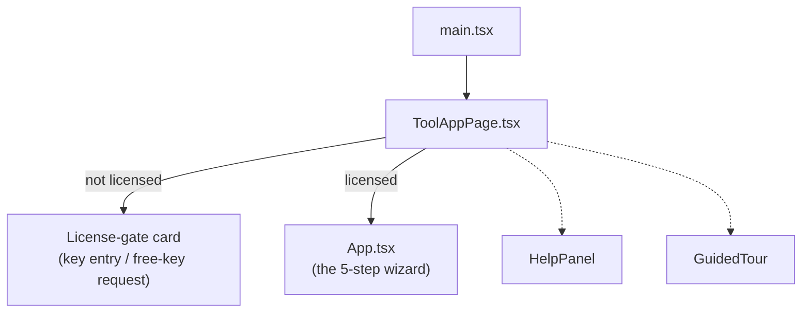
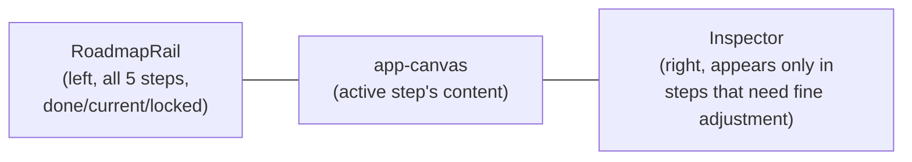
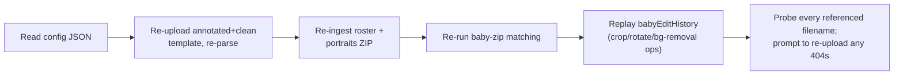

# Frontend reference (`tool/web`)

React 18 + TypeScript + Vite. No React Router pages (single mount point), no state library in actual use — despite `@tanstack/react-query` and `zustand` being listed in `package.json`, all state in the app is local `useState`/`useEffect`, centralized almost entirely in one component. That's not an oversight to "fix"; see [`09-conventions-and-known-issues.md`](09-conventions-and-known-issues.md) for why this file stays large on purpose.

## Bootstrap and mount

`src/main.tsx` renders `<ToolAppPage />` inside a `<BrowserRouter>` (basename set only for non-root subpath deployments) and `<React.StrictMode>`. `pages/ToolAppPage.tsx` owns:

- The **license-gate screen** — shown until a valid key is set; `App` never mounts before this passes. See [Licensing UI](#licensing-ui).
- Theme state (`data-theme` attribute), the topbar/footer chrome, the session-expiry countdown, and the Help/Tour system.
- Only once licensed does it render `<App embedded initialWorkspaceId=... clientSessionId=... .../>`.



## `App.tsx` — the state-machine root

`src/App.tsx` (~3,100 lines) is intentionally the largest file in the repo. It owns nearly all state and orchestration for the tool: session/workspace identity, template data, people/mapping data, style settings, generation state, config import/export, and generation polling — not just rendering. If you're changing *behavior* (what happens, what's tracked, what's persisted), you're almost always editing this file; if you're changing *how a step looks*, you're editing one of the step/component files it renders (see [Step-to-component map](#step-to-component-map)).

### State, by category

| Category | Representative state |
|---|---|
| Session/workspace identity | `sessionIdentity{sessionId,startedAtMs,expiresAtMs}`, `serverSessionExpiresAtMs`/`serverSessionExpiryDisabled` (server-authoritative, from `/api/workspaces/resolve`), `workspaceId`, `didRestoreSession` |
| Template data | `slots` (editable) vs. `parsedSlots` (pristine, for "reset to parsed"), `templateSize`, `rawDebug`, colour-override + `parseMinArea` options, `skipQuotes`/`skipBabyPhotos` |
| People/mapping data | `people`, `originalPeople`/`originalBabyPeople` (snapshots for "reset to original"), `slotAssignments`, `lockedPeople`, default quote/mugshot/baby-photo lists (+ randomize/seed), `babyEditHistory` |
| Style settings | Independent `nameFont*`/`quoteFont*` (family/weight/size/allCaps/align), `availableFonts` |
| Generation/output | `peoplePerSpread`, `outputFormat`, `outputSize`, `placementMode`, `forceAlphabetical`, `outputPath(s)`, `previewPath`, `progress`, `usageInfo` |
| Admin feature flags | Fetched once from `GET /api/admin/settings/features`; **fail open** (default `true`) on fetch error by design — a flaky settings call must never silently hide a feature a license is entitled to |
| Config import UI | `showConfigModal`, `configImportBusy/Status/Error`, `configToImport`, per-asset "missing file" prompts |

### The 5-step roadmap

```ts
TopStep = "template" | "roster" | "people" | "style" | "generate"
```

`TOP_STEPS` (label/description/icon per step) drives `RoadmapRail`. Step gating is two separate concerns:

- **`topStepReady(step)`** — can the user *navigate* here at all? Unconditionally `true` if the active license has `unlock_all_steps` (a commercial-license capability that bypasses linear gating entirely); otherwise requires the template to be parsed before Roster & Photos, and people to be loaded before People/Style/Generate.
- **`topStepComplete(step)`** — drives the RoadmapRail's checkmark, independent of whether it's currently navigable.

### Step-to-component map

The 5 roadmap steps are **not** 5 separate components. They reuse components from an earlier "Import/Edit/Finalize" redesign, each parameterized to show only what that step needs:

| Roadmap step | Renders | Parameterized via |
|---|---|---|
| **Template** (upload sub-view) | `steps/ImportStep.tsx` | `sections={["template"]}` |
| **Template** (review sub-view) | `steps/edit/EditStep.tsx` → `LayoutTab.tsx` | `editTab="layout"`, `hideTabs` |
| **Roster & Photos** (labeled "Uploads" in the UI itself) | `steps/ImportStep.tsx` | `sections={["portraits","quotes","baby"]}` (filtered by feature flags) |
| **People** | `steps/edit/EditStep.tsx` → `PeopleTab.tsx` | `editTab="people"`, `hideTabs` |
| **Style** | `steps/edit/EditStep.tsx` → `StyleTab.tsx` | `editTab="style"`, `hideTabs` |
| **Generate** | `steps/FinalizeStep.tsx` | — |

`EditStep`'s `hideTabs` prop (which `App.tsx` **always** passes `true`) suppresses its own internal Layout/People/Style `TabBar` — that three-way switcher was the *old* in-page navigation before the 5-step roadmap existed; now each tab is promoted to its own top-level roadmap step, and `App.tsx` picks which tab to show via the externally-controlled `editTab` prop instead. **If you're modifying what a step does, edit the underlying component (`ImportStep`, `LayoutTab`, `PeopleTab`, `StyleTab`, `FinalizeStep`), not `App.tsx`'s step-selection logic.**

Layout CSS note: on the People step, `ImportStep`'s optional quote/baby upload cards render *below* the people grid via a CSS `order` rule (`.edit-first` on `.app-canvas`), even though `EditStep`/`PeopleTab` and `ImportStep` are structurally siblings in the JSX, not parent/child.

### The 3-pane shell: RoadmapRail + canvas + Inspector



This is a deliberate Figma/Linear-style split: broad gestures (drag a box, click a card) happen in the canvas; precise numeric edits happen in the Inspector. `Inspector` (`components/Inspector.tsx`) is a generic shell — it is **not** rendered by `App.tsx` directly, but owned by whichever tab needs it:
- `LayoutTab.tsx` — canvas is `TemplatePreview` (drag/resize slot boxes visually); Inspector shows `SlotInspectorFields` for the selected slot's exact X/Y/W/H, plus "reset this slot to parsed."
- `PeopleTab.tsx` — canvas is the `PeopleCard` grid; Inspector shows `PersonInspector` for the selected person's portrait/baby/quote/mapping controls.

Style and the two Import-driven steps don't use an Inspector at all — the whole canvas *is* the form.

### Persistence

Four separate effects, easy to conflate:

1. **Local persistence** (`session.ts`, `localStorage` with a `sessionStorage` fallback) — fires on almost any tracked state change (after initial restore completes), immediate. This is what survives a page refresh.
2. **Server persistence** (`setWorkspaceState()`) — the same payload, debounced 300ms, POSTed to the backend keyed by `workspaceId`, skipped if unchanged since the last sync. This is what enables a **commercial** license to resume the same in-progress session from a different device.
3. **Heartbeat** (`touchWorkspace()`) — fires every `workspaceHeartbeatSeconds` (default 20s) purely to keep the workspace session alive server-side; carries no session content.
4. **Restore-on-mount** — on first mount, tries `?step=` URL override, then local storage, then falls back to the `initialWorkspaceId` prop (from `ToolAppPage`'s license-gate resolution) if no local session matches.

### Session versioning (`session.ts`)

`PersistedSessionV1` (`v:1`) is the full serialized shape — nearly a 1:1 mirror of `App.tsx`'s state. `migrateActiveStep()` is the compatibility shim that keeps old saved sessions and bookmarked `?step=` URLs working across three generations of UI:

- Current 5-step union — passed through as-is.
- Interim 3-phase model (Import/Edit/Finalize) — `"import"→"template"`, `"edit"→"people"`, `"finalize"→"generate"`.
- Legacy 8-step numeric wizard (`0`–`7`) — collapsed down: `≤1→"template"`, `2→"roster"`, `≤5→"people"` (covering the old separate mapping/quotes/baby steps), `6→"style"`, everything else `→"generate"`.

If you ever touch step numbering again, this function is where a fourth migration branch would go — don't repurpose the existing branches.

### Generation orchestration

- `runGeneration(opts)` — resolves per-person fallbacks to the configured defaults (with optional seeded-random assignment via `utils/random.ts`'s `makeRng`), calls `generateSpread()`, then polls `GET /api/generation/status` every 400ms until `output`/`error`.
- `handleRenderPreview()` — single-page preview using just the first `slots.length` people.
- `handleRenderAll()` — chunks `people` into groups of `peoplePerSpread`, runs **up to 3 chunks in parallel**, each a full `runGeneration` call with a distinct `output_filename` — this is the client-side mechanism behind `output_1.png`/`output_2.png`/... multi-spread output (see [`02-pipeline.md`](02-pipeline.md#output-naming-and-multi-spread-batches)).
- An effect auto-triggers `handleRenderPreview()` the first time the user reaches the Generate step with data ready and no existing preview.

### Config import/export

"Save config" (`handleSaveConfig`) downloads the *entire* `PersistedSessionV1` as `ymga_config_<timestamp>.json` — client-side only, no server round-trip (`configFile.ts`'s `downloadJson`). Crucially, **this does not include image bytes** — a config file references filenames that only resolve inside the workspace they were exported from.

Importing therefore isn't just "load JSON": `configImport.ts` drives a full re-materialization pipeline against a **new** workspace:



`computeMissingAssets()` probes every mugshot/baby filename referenced by the imported people list against the new workspace and surfaces the first missing one for the user to manually re-upload (`uploadImageAs()` preserves the *exact original filename* so the rest of the imported `PersonRecord` references still resolve without rewriting the whole list). `replayBabyEditsIfNeeded()` walks the imported `babyEditHistory` and re-applies crop/rotate/background-removal operations against the freshly re-uploaded baby photos, so per-photo edits made before export survive the round trip.

### Cross-tree communication

`App.tsx` and `ToolAppPage.tsx` are siblings in ownership terms (`ToolAppPage` renders `App`, but a lot of chrome — the File menu, Help, session countdown — lives in `ToolAppPage` and needs to trigger behavior inside `App`). They talk via `window` `CustomEvent`s rather than props drilling:

| Event | Direction | Purpose |
|---|---|---|
| `ymga:save-config` / `ymga:upload-config` | `ToolAppPage` → `App` | File-menu Export/Import triggers |
| `ymga:load-sample` / `ymga:load-sample-done` | `ToolAppPage` → `App` → `ToolAppPage` | "Load a sample project" (see [Help & onboarding](#help--onboarding)) |
| `ymga:flush-workspace-state` | `ToolAppPage` → `App` (with a `{resolve,reject}` detail for a reply) | Forces `App` to synchronously flush its latest state to the server before `ToolAppPage` releases a commercial workspace lock |
| `ymga:session-timing` | `App` → `ToolAppPage` | Feeds the topbar's session-expiry countdown |

## The API client (`api.ts`)

`src/api.ts` is the **single typed client** for every backend domain — a full inventory of endpoints is in [`04-api-reference.md`](04-api-reference.md). Two mechanisms worth knowing:

- An Axios request interceptor automatically attaches `X-License-Key` / `X-Device-Id` / `X-Client-Session-Id` headers to every call, reading from `licensing.ts`'s storage helpers — individual call sites never set these manually.
- For plain ``/`window.open` URLs (which can't carry custom headers), a family of `*Url` builder functions (`assetUrl`, `templateCleanUrl`, `generationDownloadUrl`, etc.) instead append `license_key`/`device_id` as **query params** via `addLicenseParams()`.

`src/types.ts` itself is only 3 lines (`Align`, `FontWeight`, `PlacementMode`) — the bulk of the backend-schema-mirroring types (`Box`, `TemplateSlots`, `PersonRecord`, `SpreadsheetPreview`, etc.) actually live inline in `api.ts`, plus `session.ts` (`PersistedSessionV1`), `licensing.ts` (`LicenseValidateResponse`), and `configFile.ts` (`ConfigFileV1`). There is no codegen from the backend's Pydantic models — when you change `schemas.py`, update these by hand.

## Licensing UI

`licensing.ts` stores `X-License-Key`/`X-Device-Id`/client-session-id in `localStorage` (the device id and cached license capabilities persist across sessions; the client-session id is `sessionStorage`, i.e. unique per browser tab). `ToolAppPage.activateLicense(key)` is the orchestrator: validates the key (`POST /api/licensing/validate`), and on success immediately calls `resolveWorkspace()` to obtain/create the backend workspace bound to that license — surfacing a lock-conflict screen if a commercial license's single workspace is already checked out by another device (see [`01-architecture.md`](01-architecture.md#workspaces--sessions)). A successful validation also caches `unlock_all_steps` if the license grants it, which is what lets some commercial licenses bypass `App.tsx`'s step-gating entirely.

## Config-driving helper modules

- **`configFile.ts`** — the on-disk container format (`{v:1, kind:"ymga_config", created_at, session}`), with back-compat parsing for bare (unwrapped) session objects.
- **`configImport.ts`** — the actual re-upload/re-parse orchestration described above, generic over a structural subset of `PersistedSessionV1` so it doesn't need to import `App.tsx`'s exact types.
- **`env.ts`** — `WEBSITE_URL` (from `VITE_WEBSITE_URL`), used only for the "back to main website" link, never for API calls.
- **`baseUrl.ts`** — `withBase(path)`, prefixes bundled static asset paths with Vite's `BASE_URL` for subpath deployments; passes through absolute/`data:`/`blob:` URLs unchanged. Byte-for-byte duplicated in `website/src/lib/baseUrl.ts` (see [`06-website.md`](06-website.md)) since the two projects don't share a build.

There is **no separate API base URL constant** anywhere in the frontend — every `api.ts` call uses a root-relative `/api/...` path, relying on same-origin serving via the Vite proxy in dev and the frontend's own proxy in production (see [`01-architecture.md`](01-architecture.md#production-topology)).

## Key components

### `TemplatePreview.tsx` + `SlotInspectorFields.tsx`

A hand-rolled (no drag library) SVG slot editor. Each of a slot's 4 parts (mugshot/baby_photo/name/quote) renders as a coloured rectangle matching the parser's own colour coding; dragging the body moves it, dragging one of 4 corner handles resizes it (10px minimum size, coordinates rounded to integer pixels). `clientToSvg()` converts mouse coordinates through the SVG's `viewBox` scale so the on-screen canvas (fixed at 720px wide) maps back to true template pixel coordinates regardless of zoom. `SlotInspectorFields` is the numeric-entry counterpart shown in the Inspector for the currently selected slot.

### `PeopleTab.tsx`

The largest step file. A toolbar for batch operations (apply staged mapping adjustments, reset to original mapping, two drag-based swap modes — full-card swap vs. portrait-only swap, the latter blocked for locked people) sits above a grid of `PeopleCard`s; clicking one selects it for the Inspector. Per-person edits (shift/replace/remove, quote text, lock toggle) accumulate as **staged adjustments** locally and are only sent to the backend as a batch when "Apply mapping adjustments" is clicked — nothing here calls `/api/mapping/review` per keystroke.

### `PersonInspector.tsx` + `BabyPhotoEditor.tsx`

`PersonInspector` is the per-person Inspector content: portrait/baby-photo thumbnails with replace/remove/reset actions, the shift-mapping controls, and the quote textarea. `BabyPhotoEditor.tsx` (~1,000 lines) is a modal, opened imperatively via a ref (`openEditor(personIndex)`), and is **the only baby-photo editor in the app** — don't reintroduce a second implementation. It wraps `react-easy-crop`, locks the crop aspect ratio to the slot's actual mask shape, and layers in:

- **Rotate** (±90°, applied at export time by rotating onto an intermediate canvas before cropping).
- **Center on face** — detects a face in the current crop, then computes and applies a target crop that puts the face at a target ~33% of the frame, with a short iterative refinement loop to work around `react-easy-crop`'s async `onCropComplete` lag.
- **Background removal preview** — uploads a downscaled preview copy, starts an async removal job, polls it, and swaps in the result as a new (still unsaved) editing source — fully non-destructive until "Apply changes" is confirmed.
- **Apply/discard** — "Apply changes" is a separate confirmation (undo isn't supported, only reset-to-original); applying appends an entry to `babyEditHistory` so the edit can be replayed on config import (see [Config import/export](#config-importexport)).

### `FontPick.tsx`

Offers both a free-text CSS font-family input and a `<select>` populated from `GET /api/fonts/list`. **Use the dropdown, not free text, for anything that has to render correctly** — the backend resolves the dropdown's quoted font name by an exact match (uploaded-file-by-name, then system-font-by-name), while a free-typed name only works if the *server's* OS/fontconfig happens to recognize that exact string. See [`02-pipeline.md`](02-pipeline.md#6-styling).

### `steps/FinalizeStep.tsx`

Pure props-driven (owns no state itself — everything lives in `App.tsx`). Renders: a stats callout (resolution, spread count, missing-asset counts), the placement-mode radio group + alphabetical-sort checkbox, output format/quality selects (aspect-ratio-locked custom width/height), the preview render + download, and — once outputs exist — the results section (usage-remaining callout, download-all/download-spreadsheet buttons, one block per rendered spread).

## Help & onboarding

- **`GuidedTour.tsx`** — a generic, portal-rendered spotlight tour component (CSS-selector targeting, auto-flips placement to stay in viewport, `Escape`/arrow-key navigation). The actual tour *content* (6 steps: welcome → roadmap rail → import card → continue button → Help button → closing) lives in `ToolAppPage.tsx`, not in the component itself. First-run trigger: opens automatically ~900ms after a valid license check if `localStorage["ymga-tour-seen-v1"]` isn't set; replaying from the Help panel does **not** re-write that flag.
- **`HelpPanel.tsx`** — a slide-over with "Load a sample project," "Replay the guided tour," a static "how it works" 5-step summary (a *third*, independent copy of step descriptions — distinct from `App.tsx`'s `TOP_STEPS` and the tour's own step text; keep these in sync by hand if you rename a step), and a link to the website's full documentation.
- **"Load a sample project"** fetches the bundled sample under `tool/web/public/assets/sample/` (a small fictional roster + a handful of real-format portraits — not the full manual test dataset) through the *normal* upload/parse/ingest pipeline, so it's also a good smoke test that the pipeline works end-to-end.
- **`InfoPopover`** — the `?`-icon contextual help used throughout `ImportStep`/`PeopleTab`/`FinalizeStep`/`StyleTab` for inline per-field explanations.

## Theming

Dark-first (default) with a light toggle. The **only** mechanism is a `data-theme` attribute set on `<html>` by `ToolAppPage.tsx` (persisted to `localStorage["ymga-app-theme"]`); every themed CSS rule keys off `[data-theme="dark"]`/`[data-theme="light"]` selectors in `styles/00-variables.css`. `index.html` has an inline pre-paint script that sets this attribute before React mounts, avoiding a flash of the wrong theme.

Stylesheets load in a fixed cascade order via `styles/index.css`:

```
00-tokens.css   theme-independent structural tokens (spacing/radius/type scale/motion/z-index)
00-variables.css  theme-scoped color/surface/shadow tokens
01-reset.css
02-shell.css    topbar/shell layout ("Sighton Services shell", shared lineage with the website)
03-components.css  generic primitives (buttons, fields, callouts, chips)
04-layout.css
05-tool.css     tool-specific UI — largest file: upload cards, people grid, inspector, baby editor...
06-modals.css
07-pages.css    ToolAppPage app-shell chrome + the documentation-page layout classes
08-workspace.css  the 5-step shell itself: .app-workspace, .roadmap-rail, .app-canvas, .layout-with-inspector
```

## `utils/` inventory

| File | Purpose |
|---|---|
| `dragDrop.ts` | Normalizes drag-and-drop `DataTransfer` into `File[]`; replicates the HTML `accept` attribute matching rules |
| `imageTransforms.ts` | Canvas-based dimension reading, 90° rotation, and horizontal spread-duplication (single-page → 2-page) for template uploads |
| `image.ts` | The shared crop+rotate→PNG export pipeline (`cropToPngBlob`), used by `BabyPhotoEditor` and config-import replay |
| `placement.ts` | Client-side mirror of the backend's slot-numbering math (`computeSlotNumberToIndex`, `comparePeopleByLastName`) — used for preview/UI purposes; the backend is authoritative at generation time |
| `random.ts` | Seeded PRNG (`makeRng`) for reproducible "randomize default portraits/quotes" |
| `slots.ts` | `groupSlotsByProximity` — powers a "regroup nearby slots" recovery action when the parser over/under-segments a template |
| `spreadUploadHandling.ts` | Shared low-resolution / portrait-orientation pre-flight checks for template uploads, used by both `ImportStep` and config import |
| `ui.ts` | `formatEtaSeconds`, `prefixServerMessage` (normalizes the "Server Message:" prefix on status/error text), `scrollPastTopBar` |

## Testing

There is no automated frontend test suite. Verify changes by running `npm run dev` in `tool/web` and exercising the actual stepper UI (golden path + edge cases), per the repo-wide convention in `CLAUDE.md`. `npm run build` (`tsc && vite build`) and `npm run lint` (`eslint .`) still catch type errors and lint issues, but neither verifies runtime behavior.
